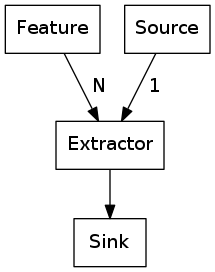

#Signal Feature Extraction Framework

This library is developed with focus on audio signals but it's base functionality is
generalized to all kinds of (time)-signals.

The key features of this library are:

- sigfeat provides an appropriate abstraction layer for the feature extraction problem:

  

- sigfeat minimizes computational cost by reducing redundancy
  of interim computation results.
- sigfeat has a low memory footprint due to generators (except your own defined features blow up memory...).


##Structure

The main base classes are: Source, Feature, Extractor and Sink.

Seven principal classes build up the whole framework:

1. Feature
2. Source
3. Sink
4. Extractor
5. Preprocess
6. Parameter
7. Result


Additionally to the basic framework, some commonly known features,
useful sources and sinks are implemented. But it is not the focus
of this project to provide a complete feature collection.
It is up to the user to define own features, sources
and sinks. This framework allows many different usage scenarios... be creative.


##Simple Example usage

```python

from pylab import plt, np

from sigfeat import Extractor
from sigfeat import features as fts

from sigfeat.source.soundfile import SoundFileSource
from sigfeat.preprocess import MeanMix
from sigfeat.sink import DefaultDictSink


extractor = Extractor(
    fts.SpectralFlux(),
    fts.SpectralCentroid(),
    fts.SpectralFlatness(),
)


src = MeanMix(SoundFileSource('bonsai.wav'))
sink = DefaultDictSink()
extractor.extract(src, sink)

plt.figure(src.name)
for l, r in sink['results'].items():
    plt.plot(r/np.max(np.abs(r)), label=str(l))
plt.legend()
plt.show()

```

## Requirements

The base framework only depends on six (sigfeat.base and sigfeat.extractor).

The namespaces sigfeat.feature .source and .preprocess depend on the
scipy stack, soundfile and pyfilterbank. It depends on which submodules
are used.
