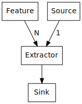

.. SigFeat documentation master file, created by
   sphinx-quickstart on Mon Feb  8 08:16:45 2016.
   You can adapt this file completely to your liking, but it should at least
   contain the root `toctree` directive.

SigFeat Documentation
=====================
A Signal Feature Extraction framework for Python.
Focused on audio signals.

Follows a clear design:

- **Source**
- **Feature**
- **Extractor**
- **Sink**

With **Parameters**, **Metadata** handling and **Preprocessing** capability.
All needed information can be written to the Sink in a clear structure.

Contents:

.. toctree::

   :maxdepth: 2

   examples

   api

Indices and tables
==================

* :ref:`genindex`
* :ref:`modindex`
* :ref:`search`

License
=======

.. include:: ../LICENSE
